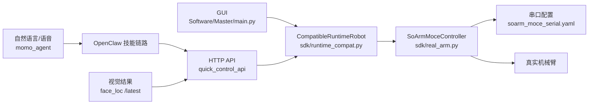

# MomoAgent 0 基础机械臂快速入门

这份文档是给第一次接触机械臂、第一次看这个仓库、或者准备给同学做分享的人写的。目标不是一下子把所有代码都讲完，而是先帮大家建立一个清晰的“地图”:

- 这个仓库到底是干什么的
- 机械臂到底是怎么被控制起来的
- 作为 0 基础同学，先学什么最不容易懵
- 怎么用 AI 做安全、可控的 vibe coding

---

## 1. 先用一句话讲清这个仓库

**MomoAgent = 机械臂本体 + 底层控制 SDK + 上层控制接口 + AI/语音交互入口。**

如果把它想成一个“机器人系统”，可以粗略分成下面几层：

| 层级 | 作用 | 关键目录 / 文件 | 小白理解版 |
|---|---|---|---|
| 硬件与模型层 | 机械臂本体、URDF、网格模型、结构件 | `step/`、`sdk/src/soarmmoce_sdk/resources/urdf/`、`sdk/src/soarmmoce_sdk/resources/meshes/` | 这是“机器人长什么样、能动哪些关节” |
| SDK 层 | 真正和机械臂串口、运动学、关节控制打交道 | `sdk/src/soarmmoce_sdk/` | 这是“底层驾驶员” |
| 控制服务层 | 把机械臂能力包装成 API、行为模式 | `Software/Master/quick_control_api/` | 这是“控制中台” |
| 交互层 | GUI、语音、自然语言、AI 代理 | `Software/Master/main.py`、`Software/Master/momo_agent/` | 这是“人怎么跟机器人说话” |
| 视觉层 | 人脸检测、目标位置反馈 | `Software/Master/face_loc/` | 这是“机器人怎么知道人在哪” |

---

## 2. 先讲整体链路，再讲具体代码

给同学讲仓库时，最容易让人听懂的方式不是直接打开一个大文件，而是先讲“命令是怎么一路传到底层硬件的”。

### 2.1 推荐讲法

你可以先说：

> 我们给机械臂下指令，不是直接去怼舵机，而是一层层往下传。最上面可以是按钮、HTTP 请求、或者自然语言；中间会被翻译成关节运动；最下面才是串口和电机。

### 2.2 当前仓库里的真实控制链路



### 2.3 这张图怎么解释

- `SoArmMoceController` 是真正控制机械臂的核心类，负责连接串口、读取状态、下发关节动作、做笛卡尔增量控制。
- `CompatibleRuntimeRobot` 是一个“兼容层”，作用是让旧的 GUI 和 API 代码还能继续用新的 SDK。
- `quick_control_api` 把“连机械臂、读状态、关节微调、回 home、跟随、巡航”等能力暴露成 HTTP 接口。
- `momo_agent` 本身不直接碰硬件，它更像“会说话的入口”，把自然语言交给 OpenClaw，再由技能链路去调用 `quick_control_api`。
- `face_loc` 负责输出目标在画面中的位置；`quick_control_api` 的 follow worker 会读取它的 `/latest` 结果来驱动机械臂跟随。

---

## 3. 给 0 基础同学必须讲清的 8 个概念

### 3.1 关节

机械臂不是整条一起动，而是每个关节分别转。这个仓库里常见的关节名有：

- `shoulder_pan`：底座左右转
- `shoulder_lift`：大臂抬起/放下
- `elbow_flex`：肘部弯折
- `wrist_flex`：腕部俯仰
- `wrist_roll`：腕部旋转
- `gripper`：夹爪开合

### 3.2 自由度 DOF

自由度可以理解成“有多少个独立能动的方向”。这个项目主臂是 5 个自由度，夹爪开合通常单独算一个执行器能力。

### 3.3 Home

这里的 `home()` 不是“机械极限零点”，而是**启动姿态参考位**。也就是说，系统会回到当前运行时定义的参考姿态，而不是拿机械硬限位做校零。

### 3.4 笛卡尔坐标

如果你说“底座右转 5 度”，这是**关节空间控制**。  
如果你说“末端往前走 5 mm”，这是**笛卡尔空间控制**。

这两个概念一定要分开：

- 关节控制：直接指定哪个关节怎么动
- 笛卡尔控制：指定末端在空间里怎么动

### 3.5 `base` 坐标系和 `tool` 坐标系

- `base`：相对于机械臂底座方向来走
- `tool`：相对于机械臂末端当前朝向来走

小白最容易混淆这一点。讲的时候可以直接说：

> `base` 像地图坐标，`tool` 像“沿着手的朝向走”。

### 3.6 SDK、API、Agent 的区别

- SDK：给程序员调用的 Python 控制能力
- API：给前端、脚本、其他服务调用的 HTTP 接口
- Agent：给人说自然语言用的入口

### 3.7 标定 Calibration

机械臂要知道“现在这个舵机角度在物理上代表什么位置”，这件事离不开标定。  
仓库里相关内容主要在：

- `sdk/src/soarmmoce_sdk/clabration/`
- `sdk/src/soarmmoce_sdk/resources/configs/soarm_moce_serial.yaml`

注意：目录名就是 `clabration`，仓库里目前就是这样拼的。

### 3.8 安全边界

给新手一定要强调：

- 第一次动作一定要小
- 速度一定要低
- 不确定方向时先试 2 到 5 度
- 有异常立刻 `stop`

---

## 4. 机械臂控制最关键的代码在哪

如果你只能带同学看 4 个文件，我建议看这 4 个：

1. `sdk/src/soarmmoce_sdk/real_arm.py`
2. `sdk/src/soarmmoce_sdk/runtime_compat.py`
3. `Software/Master/quick_control_api/src/quick_control_api/service.py`
4. `Software/Master/momo_agent/app.py`

### 4.1 `real_arm.py`

这是底层核心。你可以把它理解成：

- 连接机械臂
- 读取当前状态
- 控制单关节 / 多关节
- 控制末端位姿增量
- 回 home
- stop

### 4.2 `runtime_compat.py`

这个文件的作用是把新的 `SoArmMoceController` 包装成旧代码也能接受的样子，所以 GUI 和 API 不需要全部重写。

### 4.3 `quick_control_api/service.py`

这个文件最适合拿来讲“上层接口怎么落到底层控制”。因为里面能看到这些很直观的方法：

- `connect()`
- `robot_state_payload()`
- `joint_step()`
- `cartesian_jog()`
- `home()`
- `stop()`
- `follow_start()`
- `idle_scan_start()`

### 4.4 `momo_agent/app.py`

这个文件最适合讲“自然语言入口是什么”。它的核心不是运动学，而是：

- 接收文本或语音
- 调 OpenClaw
- 播报回复
- 把“人话”变成一轮 agent 调用

---

## 5. 给同学演示时，最快上手的 4 条路径

不是每个人都要一上来就看 SDK 源码。最好的方式是从“能看到结果”的入口开始。

### 5.1 路径 A：先用 GUI，最直观

启动方式：

```bash
cd /Users/moce/Documents/Project/MomoAgent
python Software/Master/main.py
```

这条路径适合第一次演示，因为大家能看到界面、状态、按钮，更容易建立“这是一个完整系统”的感觉。

### 5.2 路径 B：再用 HTTP API，最适合讲清控制链路

启动控制服务：

```bash
cd /Users/moce/Documents/Project/MomoAgent
source .venv/bin/activate
pip install -r Software/Master/quick_control_api/requirements.txt
python Software/Master/quick_control_api/main.py --host 0.0.0.0 --port 8010
```

检查服务是否正常：

```bash
curl --noproxy "*" http://127.0.0.1:8010/api/v1/health
```

连接机械臂：

```bash
curl --noproxy "*" -X POST http://127.0.0.1:8010/api/v1/session/connect \
  -H 'Content-Type: application/json' \
  -d '{"prefer_real":true,"allow_sim_fallback":false}'
```

查看当前状态：

```bash
curl --noproxy "*" http://127.0.0.1:8010/api/v1/robot/state
```

回到 home：

```bash
curl --noproxy "*" -X POST http://127.0.0.1:8010/api/v1/motion/home \
  -H 'Content-Type: application/json' \
  -d '{"source":"home","speed_percent":30}'
```

让底座小幅右转：

```bash
curl --noproxy "*" -X POST http://127.0.0.1:8010/api/v1/motion/joint-step \
  -H 'Content-Type: application/json' \
  -d '{"joint_index":0,"delta_deg":5.0,"speed_percent":20}'
```

让末端沿底座坐标系向前走 5 mm：

```bash
curl --noproxy "*" -X POST http://127.0.0.1:8010/api/v1/motion/cartesian-jog \
  -H 'Content-Type: application/json' \
  -d '{"axis":"+Y","coord_frame":"base","jog_mode":"step","step_dist_mm":5.0,"step_angle_deg":5.0,"speed_percent":20}'
```

紧急停止：

```bash
curl --noproxy "*" -X POST http://127.0.0.1:8010/api/v1/motion/stop
```

#### `joint_index` 对照表

| joint_index | 关节名 |
|---:|---|
| 0 | `shoulder_pan` |
| 1 | `shoulder_lift` |
| 2 | `elbow_flex` |
| 3 | `wrist_flex` |
| 4 | `wrist_roll` |
| 5 | `gripper` |

### 5.3 路径 C：直接用 SDK，适合讲“底层控制”

安装 SDK：

```bash
cd /Users/moce/Documents/Project/MomoAgent
python3 -m venv .venv
source .venv/bin/activate
pip install -U pip
pip install -e ./sdk
```

读当前状态：

```bash
python sdk/tests/manual_control_smoke.py state
```

回 home：

```bash
python sdk/tests/manual_control_smoke.py home
```

让某个关节动 5 度：

```bash
python sdk/tests/manual_control_smoke.py joint-delta --joint shoulder_pan --delta-deg 5
```

让末端走一个小增量：

```bash
python sdk/tests/manual_control_smoke.py move-delta --dx 0.01 --frame base
```

这条路径适合告诉大家：  
API 和 GUI 再往下，本质上还是在调用 SDK。

### 5.4 路径 D：自然语言演示，最像“AI 机器人”

启动：

```bash
cd /Users/moce/Documents/Project/MomoAgent
python Software/Master/momo_agent/main.py shell
```

然后你可以直接输入自然语言，例如：

- `先读取当前状态，再让机械臂回到 home`
- `把底座向右转 5 度，速度慢一点`
- `帮我把夹爪张开一点`

这一层最适合展示“AI + 机器人”的效果，但讲课时要提醒同学：

- `momo_agent` 不是直接驱动硬件
- 它更像自然语言入口
- 真正动作最后还是要走技能链路和控制服务

---

## 6. 如果要讲“自动跟人”，怎么讲最清楚

这部分建议作为第二阶段内容，不要放在第一遍入门里讲太深。

### 6.1 逻辑

人脸跟随不是“相机一看到人脸就直接转舵机”，而是：

1. `face_loc` 先做检测
2. 它通过 `/latest` 提供目标位置
3. `quick_control_api` 的 follow worker 轮询这个结果
4. 然后把偏差换成一个很小的关节修正量
5. 机械臂不断做小步调整，直到人脸回到画面中心

### 6.2 演示步骤

先启动视觉服务：

```bash
cd /Users/moce/Documents/Project/MomoAgent/Software/Master/face_loc
source ../../../.venv/bin/activate
pip install -r requirements.txt
python main.py --config configs/default.yaml --headless
```

再启动跟随：

```bash
curl --noproxy "*" -X POST http://127.0.0.1:8010/api/v1/follow/start \
  -H 'Content-Type: application/json' \
  -d '{"target_kind":"face","enable_idle_scan_fallback":true}'
```

查看状态：

```bash
curl --noproxy "*" http://127.0.0.1:8010/api/v1/follow/status
```

停止跟随：

```bash
curl --noproxy "*" -X POST http://127.0.0.1:8010/api/v1/follow/stop
```

---

## 7. 给新手讲 vibe coding，最重要的不是“酷”，而是“可控”

很多同学一听到 vibe coding，会以为就是“把需求扔给 AI，等它自己写完”。  
在机械臂这种带硬件风险的项目里，**正确的 vibe coding 应该是：让 AI 当你的结对队友，但你要给它边界、目标和验证方式。**

### 7.1 一句话定义

> vibe coding = 先让 AI 帮你理解，再让 AI 帮你改，但每次都只改一小步，并且马上验证。

### 7.2 在这个仓库里做 vibe coding 的正确姿势

1. 先让 AI 解释，不要一上来就让它改
2. 一次只改一层，不要 GUI、API、SDK 一起动
3. 明确告诉 AI 要看哪些文件
4. 明确告诉 AI 成功标准是什么
5. 明确告诉 AI 要怎么验证
6. 涉及真实机械臂时，一定要求“小角度、低速度、先读状态再动作”

### 7.3 可以直接教给同学的提示词模板

#### 模板 1：先看懂架构

```text
请先阅读这个仓库里的 quick_control_api/service.py、sdk/runtime_compat.py 和 sdk/real_arm.py，
用 0 基础能听懂的话解释：
1. 一个 joint-step 请求是怎么一路走到底层硬件的
2. 哪一层负责 API，哪一层负责真正控制机械臂
3. 哪些地方是安全敏感点
不要修改代码，先只讲清楚。
```

#### 模板 2：做一个很小的改动

```text
请只修改 quick_control_api 这一层，不要动 GUI 和 SDK。
目标：把 joint-step 的默认演示速度从 50 改成 30。
改完后告诉我你改了哪些文件、为什么这样改、我应该怎么验证。
```

#### 模板 3：排查问题

```text
请先检查为什么 /api/v1/session/connect 失败。
先读配置文件和连接代码，再给我一个按优先级排序的排查清单。
如果需要修改代码，先说明风险。
```

#### 模板 4：硬件控制类请求

```text
请通过 quick_control_api 控制机械臂：
1. 先读取当前状态
2. 再执行一个很小的动作：底座转 3 度，速度 20%
3. 如果失败，先 stop
4. 最后把执行结果和当前状态用人话告诉我
```

### 7.4 最容易踩的坑

- 让 AI 一次改很多文件，最后自己都不知道哪层出问题
- 让 AI 直接“帮我让机械臂动起来”，但没有给角度、速度和停止条件
- 没有先读当前状态，就直接下动作
- 把 Agent 层问题和 SDK 层问题混在一起排查

---

## 8. 给同学分享时，可以直接照着讲的 15 分钟版本

如果你准备做一次短分享，可以直接按这个节奏来：

### 第 1 段：这个仓库是做什么的

可以直接说：

> 这个仓库不是单纯的机械臂代码，而是一整套系统。下面有机械臂控制 SDK，中间有控制 API，上面有 GUI、自然语言和语音入口，旁边还有视觉跟随模块。

### 第 2 段：机械臂怎么动起来

可以直接说：

> 真正控制硬件的是 SDK 里的 `SoArmMoceController`。  
> GUI、HTTP API、自然语言，本质上都只是不同入口。  
> 入口把命令翻译成关节动作，最后再由串口发给真实机械臂。

### 第 3 段：最推荐的入门顺序

可以直接说：

> 新手不要一上来读全部代码。  
> 正确顺序是：先看 GUI 或 API 能不能跑，再理解控制链路，最后再看底层 SDK。

### 第 4 段：什么叫 vibe coding

可以直接说：

> vibe coding 不是瞎改，而是把 AI 当成结对搭子。  
> 先让它解释，再让它小步改动，再马上验证。  
> 在机械臂项目里，所有动作都要有安全边界。

### 第 5 段：给一个最小 demo

最小 demo 建议只做这 4 步：

1. 启动 `quick_control_api`
2. `connect`
3. `home`
4. `joint-step` 小角度转一下底座

这样既能看到效果，又不容易失控。

---

## 9. 当前仓库里几个容易讲错的点

这一节非常重要，因为如果你直接照旧 README 讲，可能会把同学讲晕。

### 9.1 根 README 里提到 `Software/Slave`

当前仓库里并没有这个目录，所以讲解时不要把现在的主链路说成“必须 master/slave 双端脚本启动”。  
就当前代码看，更稳定、也更适合演示的入口是：

- GUI：`Software/Master/main.py`
- API：`Software/Master/quick_control_api/main.py`
- 自然语言：`Software/Master/momo_agent/main.py`

### 9.2 `home` 的含义

现在的 `home()` 更接近“回到启动参考姿态”，不是“机械绝对零点”。

### 9.3 手动控制会打断行为模式

`follow` 和 `idle_scan` 这类后台行为，一旦你发了手动 `/motion/*` 指令，通常会被停止。这是有意设计的，目的是避免行为冲突。

### 9.4 `face follow` 依赖 `face_loc`

如果视觉服务没开，只开 `follow/start` 是不够的。

### 9.5 串口配置可能需要改

当前默认串口路径写在：

- `sdk/src/soarmmoce_sdk/resources/configs/soarm_moce_serial.yaml`

如果换了一台机器，串口名大概率要改。

---

## 10. 一份更像“老师讲义”的结论

如果你只想记住最核心的 4 句话，可以记这几句：

1. **这个仓库是“机械臂控制 + 视觉 + AI 交互”的完整系统，不只是一个机械臂驱动包。**
2. **真正控制机械臂的是 `sdk/src/soarmmoce_sdk/real_arm.py` 里的能力。**
3. **最适合新手理解控制链路的入口是 `quick_control_api`。**
4. **vibe coding 的关键不是全自动，而是小步、可控、能验证。**

---

## 11. 建议你带同学看的顺序

最后给一个非常实用的顺序：

1. 先看这份文档，建立全局地图
2. 再看 `Software/Master/quick_control_api/README.md`
3. 再跑一遍 `connect -> state -> home -> joint-step`
4. 再看 `sdk/src/soarmmoce_sdk/runtime_compat.py`
5. 最后看 `sdk/src/soarmmoce_sdk/real_arm.py`

如果时间很少，就先记住一句：

> **上层入口很多，但底层控制核心只有一套。**
